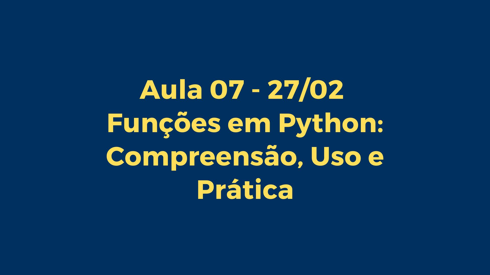

# Aula 07: Funções em Python e Estrutura de Dados - Parte 1



As funções em Python são uma das estruturas fundamentais da linguagem, permitindo a reutilização de código, a organização e a modularidade dos programas. Este guia aborda desde a motivação até a aplicação prática de funções, incluindo keywords, nomes, e como utilizá-las efetivamente.

## Conteúdo


### Motivação

A principal motivação para usar funções em Python é a **reutilização de código**. Funções permitem que você escreva um bloco de código uma vez e o execute múltiplas vezes, possivelmente com diferentes argumentos, para produzir diferentes resultados. Isso ajuda a tornar o código mais **legível**, **modular**, e **fácil de debugar**.

### Definindo Funções

Para criar uma função em Python, você usa a keyword `def`, seguida de um nome de função, parênteses `()` contendo zero ou mais "parâmetros", e dois pontos `:`. O bloco de código indentado que segue é o corpo da função.

```python
def minha_funcao():
    return "Hello, World!"
```

### Nomes de Funções

Os nomes das funções seguem as mesmas regras de nomes de variáveis em Python: podem conter letras, números (não como primeiro caractere) e underscores (`_`), mas não espaços ou caracteres especiais. Nomes de funções devem ser descritivos e, por convenção, utilizam `snake_case`.

### Parâmetros e Argumentos

* **Parâmetros** são as variáveis listadas nos parênteses na definição da função. Eles são como placeholders para os dados que a função irá processar.
    
* **Argumentos** são os valores reais passados para a função quando ela é chamada.
    

```python
def soma(a, b):
    return a + b
```

### Palavras-chave importantes

* `def` inicia a definição de uma função.
* `return` é usado para retornar um valor da função. Se omitido, a função retorna `None` por padrão.
* `pass` pode ser usado como um placeholder para uma função vazia, significando "nada".

### Chamando Funções

Para chamar uma função, use o nome da função seguido por parênteses contendo os argumentos necessários.

```python
resultado = soma(5, 3)
print(resultado)  # Saída: 8
```

### Valores Padrão e Argumentos Nomeados

Funções podem ter parâmetros com valores padrão, permitindo que sejam chamadas com menos argumentos.

```python
def cumprimentar(nome, mensagem="Olá"):
    print(f"{mensagem}, {nome}!")
```

Você também pode chamar funções com argumentos nomeados para maior clareza.

```python
cumprimentar(mensagem="Bem-vindo", nome="João")
```

## Exercícios

Vamos revisar funções adicionando type hints e Pydantic

1. **Calcular Média de Valores em uma Lista**

```python
from typing import List

def calcular_media(valores: List[float]) -> float:
    return sum(valores) / len(valores)
```

2. **Filtrar Dados Acima de um Limite**

```python
def filtrar_acima_de(valores: List[float], limite: float) -> List[float]:
    resultado = []
    for valor in valores:
        if valor > limite:
            resultado.append(valor)
    return resultados
```

3. **Contar Valores Únicos em uma Lista**

```python
def contar_valores_unicos(lista: List[int]) -> int:
    return len(set(lista))
```

4. **Converter Celsius para Fahrenheit em uma Lista**

```python
def celsius_para_fahrenheit(temperaturas_celsius: List[float]) -> List[float]:
    return [(9/5) * temp + 32 for temp in temperaturas_celsius]
```

5. **Calcular Desvio Padrão de uma Lista**

```python
def calcular_desvio_padrao(valores: List[float]) -> float:
    media = sum(valores) / len(valores)
    variancia = sum((x - media) ** 2 for x in valores) / len(valores)
    return variancia ** 0.5
```

6. **Encontrar Valores Ausentes em uma Sequência**

```python
def encontrar_valores_ausentes(sequencia: List[int]) -> List[int]:
    completo = set(range(min(sequencia), max(sequencia) + 1))
    return list(completo - set(sequencia))
```


Desafio: Análise de Vendas de Produtos
Objetivo: Dado um arquivo CSV contendo dados de vendas de produtos, o desafio consiste em ler os dados, processá-los em um dicionário para análise e, por fim, calcular e reportar as vendas totais por categoria de produto.

**Fluxo**:

```mermaid
graph TD;
    A[Início] --> B{Ler CSV};
    B --> C[Processar Dados];
    C --> D[Calcular Vendas];
    D --> E[Exibir Resultados];
    E --> F[Fim];
```

**Tarefas**:

1. Ler o arquivo CSV e carregar os dados.
2. Processar os dados em um dicionário, onde a chave é a categoria, e o valor é uma lista de dicionários, cada um contendo informações do produto (`Produto`, `Quantidade`, `Venda`).
3. Calcular o total de vendas (`Quantidade` * `Venda`) por categoria.

### Funções

1. **Ler CSV**:
    
    * Função: `ler_csv`
    * Entrada: Nome do arquivo CSV
    * Saída: Lista de dicionários com dados lidos
2. **Processar Dados**:
    
    * Função: `processar_dados`
    * Entrada: Lista de dicionários
    * Saída: Dicionário processado conforme descrito
3. **Calcular Vendas por Categoria**:
    
    * Função: `calcular_vendas_categoria`
    * Entrada: Dicionário processado
    * Saída: Dicionário com total de vendas por categoria


